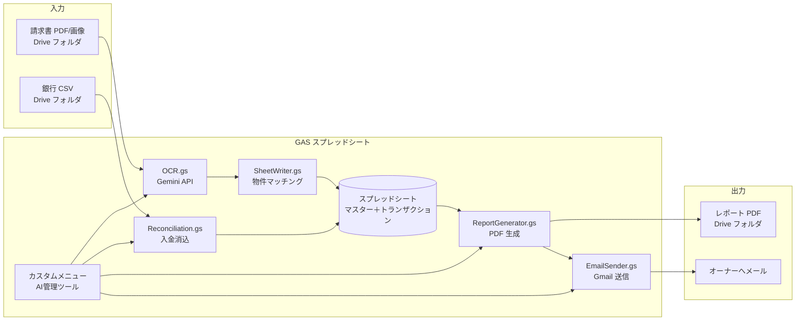

# 不動産管理 AI 自動化 ─ エンジニア引き継ぎドキュメント

**文書版数**: 1.1  
**最終更新**: 2026-06-21  
**想定読者**: 本実装を担当する社内エンジニア  
**リポジトリ**: `frogwell-property-management`（不動産管理 AI 自動化専用）

---

## 0. モック環境（稼働中）

コンサル側で構築済みの Google 環境。**エンジニアはここへのアクセス権をもらってから着手**してください。

| リソース | URL | ID（設定シート等で使用） |
|----------|-----|--------------------------|
| **メインスプレッドシート** | https://docs.google.com/spreadsheets/d/1ysF0GCagzM9-Ch071cmUGgfWzNut8yijpmwRxfco4Rk/edit | `1ysF0GCagzM9-Ch071cmUGgfWzNut8yijpmwRxfco4Rk` |
| **Google Drive（プロジェクトフォルダ）** | https://drive.google.com/drive/folders/1SfsTSLDijkQiZdE7QjYlkjVu58BL_dpe | `1SfsTSLDijkQiZdE7QjYlkjVu58BL_dpe` |

- スプレッドシートに GAS（`AI管理ツール` メニュー）が紐づいています。コード更新時は **拡張機能 → Apps Script** から `_PASTE_ME_Code.gs` を貼り付け。
- Drive フォルダ内に、請求書・入金 CSV・レポート出力用のサブフォルダがある想定です。各フォルダ ID はスプレッドシートの **「設定」シート**（`INVOICE_FOLDER_ID` 等）を確認してください。
- GAS プロジェクト URL はスプレッドシートから **拡張機能 → Apps Script** で開けます。

---

## 1. このドキュメントの目的

コンサル案件として構築した **Google Apps Script（GAS）＋ Gemini OCR のモック**を、クライアント本番環境へ引き渡すための技術引き継ぎ資料です。

- **何を自動化するか**（業務背景）
- **今どこまで動いているか**（モックの実装状況）
- **コードの構造と設計判断**
- **先方実データを見て判明した論点**
- **本実装で残る作業・リスク**

を一通り把握できることを目的としています。

---

## 2. 案件概要

### 2.1 クライアントの業務（現状）

マレーシアの不動産管理会社（委託管理）が、以下を**手作業**で行っている。

| 業務 | 現状 | 自動化の方向性 |
|------|------|----------------|
| 請求書処理 | PDF/画像を目視 → Excel 手入力 | Drive フォルダ投入 → AI OCR → スプレッドシート |
| オーナー別レポート | Excel でフィルタ → 手作業で PDF/メール | ボタン操作で PDF 生成・一括送信 |
| 入金消込 | 銀行明細とテナント名を目視照合 | 銀行 CSV 取込 → 区画番号ベースで自動消込 |
| 仲介会社からの問い合わせ | 空き物件・写真・鍵あけ等を手動返信 | ナレッジベース＋自動返信（**企画のみ・未実装**） |
| テナントからの問い合わせ | WhatsApp/LINE/メールで受付・業者手配 | AI 分類＋チケット化（**企画のみ・未実装**） |

### 2.2 第一弾スコープ（合意イメージ）

1. **請求書 OCR ＋ オーナー紐付け**
2. **オーナー別月次レポート生成・メール送信**
3. **家賃入金の消込**

問い合わせ自動化は **Phase 2**（企画書のみ存在）。

### 2.3 技術選定の理由（モック時点）

| 選択 | 理由 |
|------|------|
| Google Apps Script | クライアントが Google Workspace 利用。Sheets/Drive/Gmail と一体 |
| Gemini 2.5 Flash Lite | マルチモーダル OCR。コスト・速度のバランス |
| スプレッドシートを DB 兼 UI | モック速度優先。本番でも当面は許容、将来的に移行検討 |

---

## 3. アーキテクチャ

### 3.1 全体フロー



### 3.2 物件特定の共通キー（最重要）

請求書・消込・レポートはすべて **「物件名（建物名）＋ 部屋番号 / 区画番号」** で一貫させている。

```
マスター_物件:  物件名 + 部屋番号  →  オーナー名
マスター_テナント: 物件名 + 区画番号  →  テナント名・家賃（オーナーは物件マスター経由）
請求書 OCR:     建物名 + unit_no   →  resolveOwner_() → オーナー名
入金消込:       摘要から unit 抽出  →  テナントマスター照合 → オーナー名
```

**オーナー ID は廃止**。先方の実データが「名前のみ」だったため。

### 3.3 外部依存

| サービス | 用途 | 設定場所 |
|----------|------|----------|
| Google AI Studio (Gemini API) | 請求書 OCR | `設定` シート `GEMINI_API_KEY` |
| Google Drive | 請求書・入金 CSV・レポート PDF の保管 | 各フォルダ ID |
| Gmail (GmailApp) | レポート送信 | GAS 実行ユーザーの Gmail |
| Google Sheets | データストア・UI | メインスプレッドシート |

---

## 4. リポジトリ構成

```
frogwell_sandbox/
├── gas/                          ← 本案件の実装本体
│   ├── Config.gs                 定数・シート名・ヘッダー定義
│   ├── Main.gs                   カスタムメニュー・エントリーポイント
│   ├── Setup.gs                  初期セットアップ・サンプルマスター
│   ├── DriveScanner.gs           請求書フォルダの新規ファイル検知
│   ├── OCR.gs                    Gemini API 呼び出し・構造化抽出
│   ├── SheetWriter.gs            OCR 結果書込・物件マッチング（resolveOwner_）
│   ├── Reconciliation.gs         銀行 CSV 取込・入金消込
│   ├── ReportGenerator.gs        オーナー別 PDF レポート
│   ├── EmailSender.gs            レポートメール送信
│   ├── Dashboard.gs              ダッシュボード集計更新
│   ├── Inquiry.gs                問い合わせ対応（分類→チケット→通知→返信／メール・WhatsApp）
│   ├── _PASTE_ME_Code.gs         ★ 上記を1ファイルに統合（手動デプロイ用）
│   ├── appsscript.json           OAuth スコープ定義
│   └── README.md                 セットアップ手順（開発者向け）
├── sample-invoices/              サンプル請求書 HTML（PDF 化してテスト用）
├── sample-deposits/              サンプル銀行 CSV
└── docs/                         提案・ヒアリング・企画資料
    ├── 01_業務フロー確認書.html
    ├── 02_ヒアリングシート.html
    ├── 03_アウトプットイメージ.html
    ├── 04_プロトタイプ機能一覧.html
    ├── 05_問い合わせ自動化_企画.html      ← Phase 2 企画（未実装）
    ├── 06_第一弾_ヒアリングリスト.md           ← クライアントへの確認事項（本文）
    ├── 06_第一弾_ヒアリングリスト_回答用.csv   ← スプレッドシートで回答記入用
    └── REAL_ESTATE_AI_ENGINEERING_HANDOFF.md  ← 本ドキュメント
```

> **注意**: ルートには Salesforce MCP 関連（`salesforce-mcp/`, `slack-worker/`）も存在するが、**本案件とは無関係**。`docs/ENGINEERING_HANDOFF.md` は別プロジェクト用。

---

## 5. スプレッドシート構成（データモデル）

### 5.1 シート一覧

| シート名 | 役割 |
|----------|------|
| メニュー | ダッシュボード（件数サマリー） |
| 請求書データ | OCR 結果のトランザクション |
| マスター_物件 | 物件名・部屋番号 → オーナー名 |
| マスター_オーナー | オーナー連絡先・手数料率 |
| マスター_テナント | テナント契約情報（先方フォーマット準拠） |
| マスター_建物別名 | 建物名の表記ゆれ名寄せ |
| 入金消込 | 月次消込結果 |
| 設定 | API キー・フォルダ ID 等 |
| _レポートテンプレート | 非表示・レポートレイアウト参考 |

### 5.2 列定義（`Config.gs` が正）

#### 請求書データ

| 列 | 内容 |
|----|------|
| ID | INV-0001 形式 |
| 請求日 | |
| 物件名 | OCR 抽出の建物名 |
| オーナー | `resolveOwner_` の結果 |
| 費目 | 水道代/電気代/管理費/修繕費 等 |
| 金額 (MYR) | |
| 支払先 | 請求元 |
| 元ファイルURL | 重複処理防止キー |
| ステータス | AI読取済 / 要確認 / 確認済 |
| 備考 | OCR メモ・マッチング注記 |
| ユニット番号 | OCR またはファイル名から |
| 住所 | OCR 抽出 |

#### マスター_物件（先方オーナーリスト準拠）

| 列 | 内容 |
|----|------|
| 物件名 | 建物名（例: The Mews, St Regis） |
| 部屋番号 | 例: A-36-1, 46-5, 29 |
| オーナー名 | 例: Ito, Beslife Co., Ltd |
| 住所 | 任意（現状サンプルは空） |

#### マスター_オーナー

| 列 | 内容 |
|----|------|
| オーナー名 | キー（物件マスターと一致させる） |
| メール | レポート送付先 |
| 管理手数料率(%) | 空欄時は設定 `MANAGEMENT_FEE_PCT`（既定 8%） |
| 備考 | |

#### マスター_テナント（先方契約一覧準拠）

| 列 | 内容 |
|----|------|
| 物件名 | |
| 区画番号 | 物件マスターの「部屋番号」と同一キー |
| テナント名 | |
| 契約開始 / 契約終了 | |
| 更新期間 / 解約予告(月) | |
| 月間家賃 (RM) | 消込の請求額 |
| 敷金Security / 敷金Utility | |
| 備考 | |

#### マスター_建物別名

| 列 | 内容 |
|----|------|
| 検出された建物名 | OCR や請求書に出た表記 |
| 正規 建物名 | マスター_物件の物件名 |
| 備考 | |

#### 入金消込

| 列 | 内容 |
|----|------|
| 対象月 | |
| オーナー / 物件 / テナント | |
| 請求額 / 入金額 / 入金日 | |
| ステータス | 消込済 / 一部入金 / 未入金 / 過入金 / 要確認 |
| 備考 | |

### 5.3 設定シートのキー

| キー名 | 用途 |
|--------|------|
| GEMINI_API_KEY | Google AI Studio API キー |
| INVOICE_FOLDER_ID | 請求書 PDF 投入フォルダ |
| REPORT_FOLDER_ID | 生成 PDF の保存先 |
| DEPOSIT_FOLDER_ID | 銀行 CSV 投入フォルダ |
| COMPANY_NAME / COMPANY_EMAIL / COMPANY_TEL | メール署名 |
| MANAGEMENT_FEE_PCT | デフォルト管理手数料率 |

---

## 6. 主要ロジック（実装詳細）

### 6.1 請求書 OCR（`OCR.gs`）

- **モデル**: `gemini-2.5-flash-lite`（旧 `gemini-2.0-flash` は 404 で使用不可）
- **入力**: PDF / JPEG / PNG / WebP（Base64 で Gemini に送信）
- **出力 JSON フィールド**: `invoice_date`, `property_name`, `unit_no`, `address`, `category`, `amount`, `payee`, `confidence`, `notes`
- **リトライ**: 503 / 429 / 500 に対し指数バックオフ（最大 4 回）
- **ファイル名**: プロンプトに参考情報として渡す（重要: 後述）

### 6.2 物件マッチング（`SheetWriter.gs` → `resolveOwner_`）

マッチング優先順位:

1. **建物名（別名名寄せ後）＋ 部屋番号** が一意一致
2. **建物名のみ** が一意一致（部屋番号不一致時は注記付き）
3. **部屋番号のみ** がマスター全体で一意（建物名不一致時）← TNB 電気代対応で追加
4. 上記いずれも不可 → 要確認。建物名があれば「マスター_建物別名」へ自動追記

**正規化ヘルパー**（`SheetWriter.gs`）:

- `normalizeForMatch_` — 小文字化・記号除去（建物名比較）
- `normalizeUnit_` / `unitEquals_` — `46-5` = `46-05`, `A-36-1` = `a-36-01`
- `extractUnitFromText_` — 摘要・ファイル名からハイフン連結トークン抽出
- `buildingNamesMatch_` — 部分一致許容
- `canonicalBuildingName_` — 別名シートで名寄せ

### 6.3 入金消込（`Reconciliation.gs`）

- 入金 CSV フォルダ内の全 `.csv` を読込
- ヘッダー行から「日付」「摘要」「入金額」列を推測（日英対応）
- **摘要から区画番号を抽出** → テナントマスターと照合
- 同一区画番号が複数物件にある場合は摘要内の建物名で絞り込み
- 区画番号が読めない行（手数料・JOMPAY 等）は無視
- テナントの月間家賃と入金額を比較してステータス判定
- 結果は「入金消込」シートを**全置換**（履歴は残さない — 本番要検討）

### 6.4 レポート（`ReportGenerator.gs`）

- オーナー名をキーに物件・請求・テナント収入を集約
- 一時シート `_tmp_report` を作成 → Spreadsheet PDF エクスポート → Drive 保存 → 一時シート削除
- 収入: テナントマスターの家賃 ＋ 消込ステータスを併記
- 支出: 確認済み請求書 ＋ 管理手数料（賃料 × 率）
- **制限**: 請求書は `ステータス=確認済` フィルタなしでオーナー名一致のみ（要改善余地）

### 6.5 カスタムメニュー（`Main.gs`）

| メニュー項目 | 関数 | 説明 |
|--------------|------|------|
| 初期セットアップ | `runSetup` | 全シート作成 |
| サンプルマスター投入 | `runInsertSampleMaster` | 実データベースのサンプル 20 物件 |
| OCR バッチ実行 | `runOcrBatch` | 新規請求書を処理 |
| オーナー再紐付け | `runReassignOwners` | マスター更新後に請求書のオーナー列を再計算 |
| 入金CSV取込（消込） | `runImportDeposits` | 消込実行 |
| レポート生成（全オーナー） | `runGenerateAllReports` | |
| レポート生成（オーナー選択） | `runGenerateSelectedReport` | オーナー名をプロンプト入力 |
| レポート一括メール送信 | `runSendAllReports` | メール空欄はスキップ |
| ダッシュボード更新 | `runUpdateDashboard` | |

---

## 7. 実装状況（モック時点）

### 7.1 実装済み ✅

| 機能 | 状態 | 備考 |
|------|------|------|
| シート初期化・サンプルマスター | ✅ | 先方オーナーリスト 20 件反映 |
| Drive 請求書スキャン・重複排除 | ✅ | URL ベース |
| Gemini OCR（PDF/画像） | ✅ | リトライ付き |
| 物件→オーナー紐付け | ✅ | 別名・ユニット一意フォールバック |
| 入金 CSV 消込（区画番号ベース） | ✅ | サンプル CSV で検証可能 |
| オーナー別 PDF レポート | ✅ | |
| Gmail 一括送信 | ✅ | |
| ダッシュボード集計 | ✅ | |
| 手動デプロイ用統合ファイル | ✅ | `_PASTE_ME_Code.gs` |

### 7.2 部分実装 / 要改善 ⚠️

| 項目 | 現状 | 本番で必要な対応 |
|------|------|------------------|
| clasp デプロイ | ローカル `clasp login` 失敗のため手動コピペ運用 | CI/CD または clasp 整備 |
| 請求書の「確認済」フロー | ステータス列はあるが UI 操作なし | 確認ワークフロー・権限 |
| レポートの支出集計 | 全請求書を対象（ステータス未フィルタ） | 確認済のみ等のルール |
| 消込履歴 | 毎回シート全置換 | 月次履歴保持 |
| 銀行明細 | CSV のみ | 先方は CIMB PDF の可能性（未確認） |
| 口座番号マスター | なし | TNB 等で最も確実なキーになり得る |
| ハイフン無し部屋番号（例: `29`） | 摘要からの自動抽出不可 | 別ロジック or マスター拡張 |
| エラーハンドリング | Logger + UI アラート | 運用通知（Slack/メール） |
| テスト | 手動のみ | 単体テスト困難（GAS 制約）→ 抽出ロジックの切り出し検討 |
| タイムゾーン | `Asia/Tokyo` 固定 | クライアントは MY。`Asia/Kuala_Lumpur` 要確認 |

### 7.2.x 問い合わせ対応（Phase 2）モック実装 ⚠️

| 項目 | 現状 | 本番で必要な対応 |
|------|------|------------------|
| 受信→分類→チケット→通知→返信の中核 | ✅ `Inquiry.gs`（チャネル非依存） | サンプル問い合わせで分類精度評価 |
| メールアダプタ（Gmail 受信／スレッド返信） | ✅ ラベル検索＋手動/トリガー | 専用アドレス・トリガー運用 |
| WhatsApp アダプタ（Twilio 送信＋`doPost` 受信） | ✅ Sandbox で疎通可 | 本番番号・承認テンプレ・24h ルール |
| テナント連絡先による送信者特定 | ✅ `マスター_テナント` に メール/WhatsApp番号 列 | 本番テナント連絡先の投入 |
| 特定不可時の要確認フォールバック | ✅ | - |
| 業者手配・オーナー費用承認 | ❌ 企画のみ（2-D） | ワークフロー実装 |

### 7.3 未実装（企画のみ） ❌

| 機能 | 参照資料 |
|------|----------|
| 業者手配・オーナー費用承認（2-D） | `docs/05_問い合わせ自動化_企画.md` §9 |
| 空き物件・業者マスターの本運用 | 同上 §5.4 / §5.5 |
| 定期バッチ（トリガー） | メニュー手動実行のみ |
| 権限・監査ログ | なし |
| 本番用マスター CSV インポート | 手入力 or サンプル投入のみ |

---

## 8. 先方実データから判明した論点

### 8.1 受領済みサンプル

| 資料 | 内容 |
|------|------|
| 請求書 7 種 | TNB 電気・水道・Assessment fee・Service charge・修繕・Malakoff 等 |
| テナント契約情報一覧 | 物件名・区画番号・契約期間・家賃・敷金 |
| オーナーリスト（CSV） | 物件名・部屋番号・オーナー名（20 件） |

### 8.2 未受領（ヒアリング中）

- オーナーへの**実際の月次レポート**サンプル
- **銀行入金明細**（CIMB 等）実物 1 ヶ月分
- オーナー**メールアドレス**一覧
- 仲介・テナント問い合わせ履歴

→ 詳細は `docs/06_第一弾_ヒアリングリスト.md` セクション 5 を参照。

### 8.3 請求書 OCR の典型パターン（重要）

#### ケース A: 本文に部屋番号なし（TNB 電気代）

- **ファイル名**: `TNB Mews A-36-1_May2026.pdf`
- **本文**: 住所に `PANGSAPURI SERVIS MEWS` のみ。部屋番号・「The Mews」表記なし
- **対応**: ファイル名から `A-36-1` 抽出 ＋ ユニット一意フォールバックで `Ito` に紐付け
- **別名**: `PANGSAPURI SERVIS MEWS` → `The Mews` を別名マスターに登録推奨

#### ケース B: 建物名が正式名と異なる

- 請求書・銀行摘要では略称・住所表記・マレー語表記
- **対応**: `マスター_建物別名` の運用 ＋ 先方から正式名⇔別表記一覧の取得

#### ケース C: 部屋番号の表記ゆれ

- `29`（ハイフン無し）、`20-G`、`T1-19-3a` 等
- **対応**: `normalizeUnit_` で一部吸収。ハイフン無し単独数字は摘要抽出不可

#### ケース D: 口座番号（TNB NO. AKAUN）

- 請求書に必ず載るが、現システムでは未使用
- **本番推奨**: `口座番号 → 部屋番号` マスターを追加すると OCR 精度が最も安定

### 8.4 消込の実態

- 先方テナント表に「振込名義」列は**ない**
- CIMB 明細の家賃入金は摘要に**区画番号**が入る（例: `Mews11 A-32-2 RENTAL JAN 26`）
- よって消込キーは **区画番号ベース**（実装済み）

---

## 9. 開発・デプロイ手順

### 9.1 モック環境（現在の運用）

**既存環境を使う場合（推奨）**

| リソース | URL |
|----------|-----|
| スプレッドシート | https://docs.google.com/spreadsheets/d/1ysF0GCagzM9-Ch071cmUGgfWzNut8yijpmwRxfco4Rk/edit |
| Drive フォルダ | https://drive.google.com/drive/folders/1SfsTSLDijkQiZdE7QjYlkjVu58BL_dpe |

1. 上記スプレッドシートへ編集権限をもらう
2. 「拡張機能」→「Apps Script」を開く
3. `gas/_PASTE_ME_Code.gs` の**全文**をエディタに貼り付け（既存コードを置換）→ 保存
4. スプレッドシートをリロード → メニュー「AI管理ツール」から動作確認
5. 「設定」シートの API キー・各フォルダ ID が入っているか確認

**新規に環境を作る場合**

`clasp` が使えない環境では **手動コピペ** でデプロイしている。

1. Google スプレッドシートを新規作成
2. 「拡張機能」→「Apps Script」を開く
3. `gas/_PASTE_ME_Code.gs` の**全文**をエディタに貼り付け（既存コードを置換）
4. `appsscript.json` の OAuth スコープが必要ならマニフェストも反映
5. スプレッドシートをリロード → メニュー「AI管理ツール」→「初期セットアップ」
6. 「設定」シートに API キー・フォルダ ID を入力
7. Drive に請求書フォルダ・入金 CSV フォルダ・レポートフォルダを作成

詳細: `gas/README.md`

### 9.2 clasp を使う場合（推奨・未整備）

```powershell
npm install -g @google/clasp
clasp login          # ERR_CONNECTION_REFUSED 時は clasp login --no-localhost
cd gas
clasp create --type sheets --title "不動産管理_メインデータ"
clasp push
clasp open
```

- モジュール分割版（`Config.gs` 等）と `_PASTE_ME_Code.gs` は**内容を同期**する必要あり
- 変更時は両方更新するか、ビルドスクリプトで統合を自動化すること

### 9.3 OAuth スコープ（`appsscript.json`）

```
spreadsheets, drive, gmail.send, script.external_request, script.scriptapp
```

初回実行時にユーザー承認が必要。本番では**サービスアカウント不可**（GmailApp はユーザー実行）。

---

## 10. 本実装への推奨ロードマップ

### Phase 1: モックの本番化（第一弾）

1. **クライアントヒアリング完了**（`06_第一弾_ヒアリングリスト.md` / 回答用 CSV）
2. **本番マスター投入**
   - オーナーリスト 20 件 → `マスター_物件`
   - テナント契約一覧 → `マスター_テナント`
   - オーナーメール → `マスター_オーナー`
   - 建物別名・口座番号マスター（新規シート検討）
3. **請求書運用ルールの確定**
   - ファイル命名規則（部屋番号をファイル名に含めるか）
   - 確認フロー（要確認 → 確認済）
4. **銀行明細取込**
   - CSV 形式の確認 / PDF パース要否
   - 月次トリガー（GAS Time-driven trigger）
5. **レポート**
   - 先方サンプルに合わせた PDF レイアウト調整
   - 管理手数料・費目ルールの実装
6. **運用**
   - エラー通知、実行ログ、バックアップ
   - 権限（誰が GAS を実行するか — 共有アカウント推奨）

### Phase 2: 問い合わせ自動化

- 詳細企画: [`docs/05_問い合わせ自動化_企画.md`](./05_問い合わせ自動化_企画.md)（実装向け）
- 提案資料: [`docs/05_問い合わせ自動化_企画.html`](./05_問い合わせ自動化_企画.html)（先方向け）
- メール MVP（Gmail ラベル + 分類 + チケット）→ WhatsApp アダプタ接続
- ナレッジベース（仲介）＋ AI 分類＋チケット（テナント）

### Phase 3: アーキテクチャ見直し（必要に応じて）

GAS の制約（実行時間 6 分、デバッグ困難、スケール）が問題になった場合:

- バックエンド（Cloud Functions / Cloud Run）＋ Sheets API
- OCR パイプラインの分離
- DB 移行（Firestore / BigQuery 等）

---

## 11. 既知のバグ・技術的負債

| # | 内容 | 深刻度 | 対応案 |
|---|------|--------|--------|
| 1 | `_PASTE_ME_Code.gs` とモジュール版の二重管理 | 中 | 統合スクリプト or clasp のみに統一 |
| 2 | 消込シート全置換で履歴消失 | 中 | 月次タブ or 別シート追記 |
| 3 | OCR.gs 先頭コメントが「Gemini 2.0 Flash」と記載 | 低 | コメント修正 |
| 4 | レポートの請求書フィルタ未実装 | 中 | `CONFIRMED` のみ集計 |
| 5 | `insertSampleMasterData_` は既存行があるとスキップ | 低 | マイグレーション手順書が必要 |
| 6 | 同一 GAS プロジェクトに Salesforce 系 docs が混在 | 低 | リポジトリ整理 or 案件別ブランチ |

---

## 12. 関連ドキュメント索引

| ファイル | 用途 | 読者 |
|----------|------|------|
| `docs/REAL_ESTATE_AI_ENGINEERING_HANDOFF.md` | **本ドキュメント** | エンジニア |
| `gas/README.md` | セットアップ・操作手順 | エンジニア |
| `docs/04_プロトタイプ機能一覧.html` | モックでできること一覧 | クライアント・エンジニア |
| `docs/06_第一弾_ヒアリングリスト.md` | 先方確認事項（本文） | クライアント |
| `docs/06_第一弾_ヒアリングリスト_回答用.csv` | 回答記入用（スプレッドシート） | クライアント |
| `docs/01_業務フロー確認書.html` | 現状業務フロー | クライアント |
| `docs/03_アウトプットイメージ.html` | 画面・出力イメージ | クライアント |
| `docs/05_問い合わせ自動化_企画.html` | Phase 2 企画 | エンジニア・PM |

---

## 13. 引き継ぎチェックリスト

エンジニアが着手前に確認すべき項目:

- [ ] **稼働中モック**へアクセスできる（[スプレッドシート](https://docs.google.com/spreadsheets/d/1ysF0GCagzM9-Ch071cmUGgfWzNut8yijpmwRxfco4Rk/edit) / [Drive](https://drive.google.com/drive/folders/1SfsTSLDijkQiZdE7QjYlkjVu58BL_dpe)）
- [ ] Google AI Studio API キーを取得・設定できる
- [ ] `_PASTE_ME_Code.gs` を GAS にデプロイし「初期セットアップ」が通る
- [ ] サンプル請求書 PDF で OCR → オーナー紐付けまで確認
- [ ] `sample-deposits/sample_bank_statement_2026-06.csv` で消込確認
- [ ] レポート PDF 生成・メール送信（テスト用に自分のアドレスへ）
- [ ] `docs/06_第一弾_ヒアリングリスト_回答用.csv` の未回答項目を PM と共有
- [ ] Phase 2（問い合わせ）のスコープを受け入れ基準と合意

---

## 14. 問い合わせ・エスカレーション

| 項目 | 担当 |
|------|------|
| 業務要件・クライアント折衝 | （PM / コンサル担当名を記載） |
| 先方サンプル・ヒアリング | 同上 |
| 技術実装 | 引き継ぎ先エンジニア |
| Google Workspace / API キー | クライアント IT または PM |

---

*本ドキュメントはモック開発の知見に基づく。クライアントヒアリング結果で設計が変わる可能性がある。更新時は版数と日付を increment すること。*
